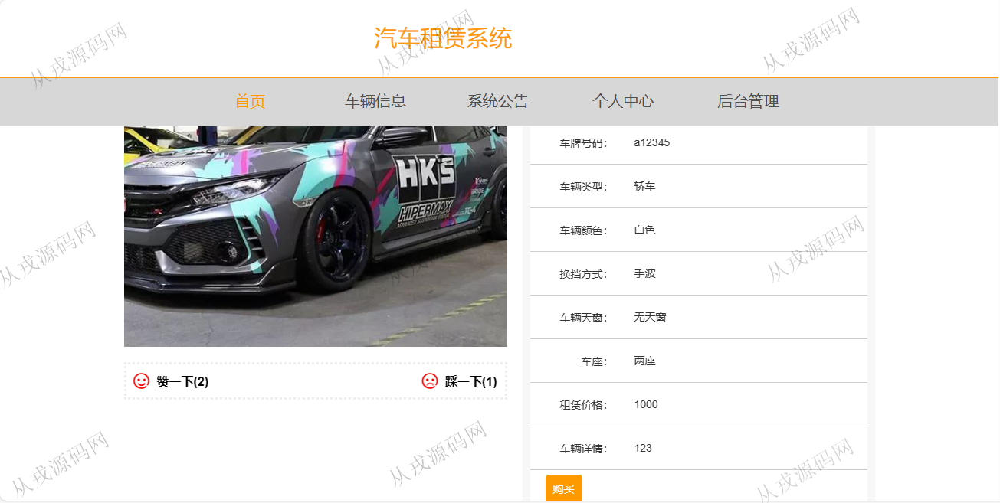
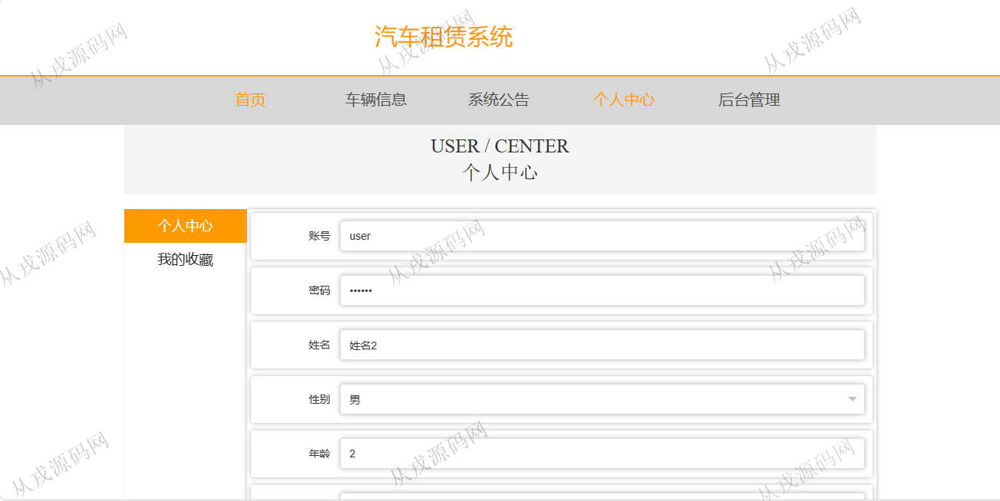
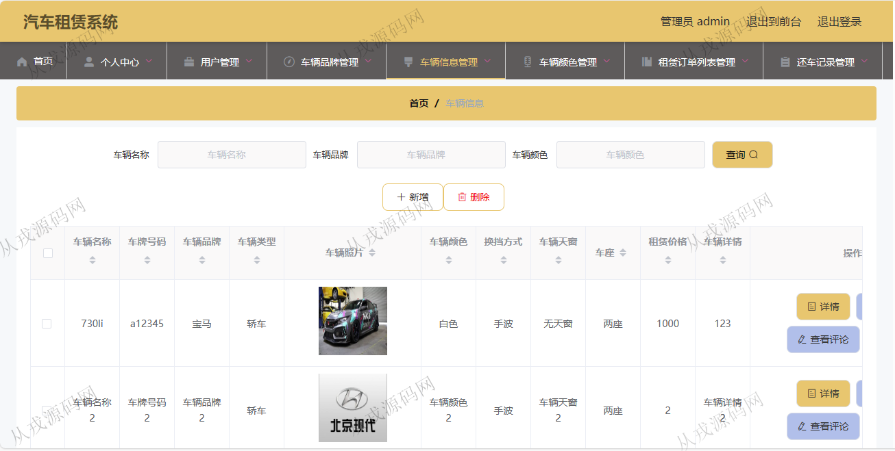
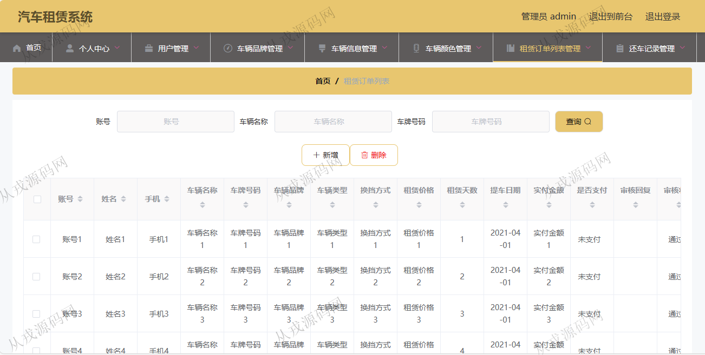
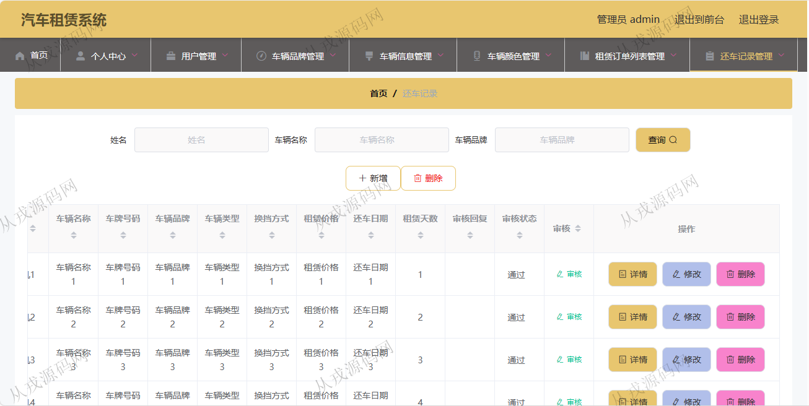

<h1 align="center">166.汽车租赁管理系统</h1>

- <b>完整代码获取地址：从戎源码网 ([https://armycodes.com/](https://armycodes.com/))</b>
- <b>技术探讨、资料分享，请加QQ群：692619798</b> 
- <b>作者微信：19941326836  QQ：952045282</b> 
- <b>承接计算机毕业设计、Java毕业设计、Python毕业设计、深度学习、机器学习</b>
- <b>选题+开题报告+任务书+程序定制+安装调试+论文+答辩ppt 一条龙服务</b>
- <b>所有选题地址 ([https://github.com/YuLin-Coder/AllProjectCatalog](https://github.com/YuLin-Coder/AllProjectCatalog)) </b>

## 项目介绍
基于springboot+vue的汽车租赁管理系统：前端 vue、elementui，后端 maven、springmvc、spring、mybatis；角色分为管理员、用户；集成汽车信息浏览，在线租赁，还车等功能于一体的系统。

## 功能介绍

### 用户

- 基本操作：登录、注册、修改个人信息、查看基本资料
- 车辆信息模块：获取车辆列表、筛选车辆、查看车辆信息详情、点赞、拉踩、评论车辆、租赁、收藏车辆
- 系统公告模块：获取系统公告列表、查看系统公告详情
- 其他操作：获取轮播图列表、查看收藏列表

### 管理员

- 基本操作：登录、修改密码、获取个人信息
- 用户管理：新增用户、获取用户列表、筛选用户信息、查看用户信息详情、修改用户信息、删除用户
- 车辆品牌管理：新增品牌、筛选品牌、修改品牌信息、删除品牌
- 车辆信息管理：筛选车辆、获取车辆信息列表、查看车辆信息详情、修改车辆信息、删除车辆信息、查看车辆评论
- 车辆颜色管理：筛选车辆颜色、新增车辆颜色、修改车辆颜色、删除车辆颜色
- 租赁订单管理：筛选订单、删除订单、审核租赁请求、修改订单信息、查看订单信息详情
- 还车信息管理：筛选还车信息、上传还车信息、查看还车信息详情、修改还车信息、删除还车信息
- 管理员管理：新增管理员、搜索管理员、查看管理员信息详情、修改管理员信息、删除管理员

## 环境

- <b>IntelliJ IDEA 2021.3</b>

- <b>Mysql 5.7.26</b>

- <b>Node 14.14.0</b>

- <b>JDK 1.8</b>

## 运行截图

